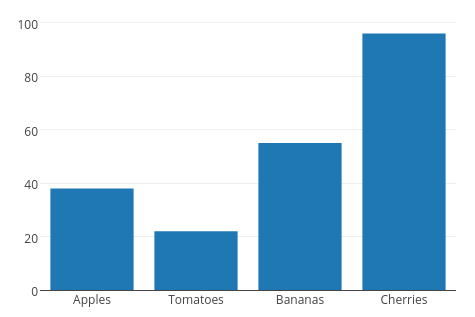
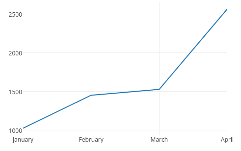

# CakeCharts plugin for CakePHP

[](https://scrutinizer-ci.com/g/jtraulle/CakeCharts/?branch=master)
[](https://packagist.org/packages/jtraulle/cake-charts)
[](https://packagist.org/packages/jtraulle/cake-charts)
[](https://packagist.org/packages/jtraulle/cake-charts)

## Purpose

This plugin is a CakePHP wrapper for [plotly.js](https://plot.ly/javascript/) charting library. It offers you a simple way to draw charts in your CakePHP app using provided ```DrawChart``` helper without having to write Javascript.

## Installation

You can install this plugin into your CakePHP application using [composer](http://getcomposer.org).

The recommended way to install composer packages is:

```
composer require jtraulle/cake-charts
```
### 1. Load Plugin

Add this line into your ```config/bootstrap.php```

```php
<?php
Plugin::load('CakeCharts', ['autoload' => true]);
```

### 2. Load Helper

Add this line into your ```src/View/AppView.php```

```php
<?php
$this->loadHelper('CakeCharts.DrawChart');
```
### 3. Add view blocks into your default Layout

Add those lines just before closing the ```</body>``` tag in your ```src/Template/Layout/default.ctp```

```php
<?= $this->fetch('cakeChartsLibrary');
    $this->fetch('cakeChartsDefinition'); ?>

```

## Usage

From any template :

* Single series functions signatures and phpDoc:

```php
<?php
/**
 * Function structure for single series charts
 *
 * @param array $x Values to be placed on X axis
 * @param array $y Values to be placed on Y axis
 * @param string $mode For line charts only.
 *                     Can be either "markers", "lines" or "markers+line"
 * @param array $layout Any layout option accepted by Plotly.js
 * @see https://plot.ly/javascript/#layout-options for possible values
 * @param array $configuration Any configuration option accepted by Plotly.js
 * @see https://plot.ly/javascript/configuration-options for possible values and examples
 * @param string|null $id HTML identifier of div where chart will be drawed
 * @return string The generated chart
 */
$this->DrawChart->makeSimpleBarChart(array $x, array $y, array $layout = [], array $configuration = [], string $id = null);
$this->DrawChart->makePieChart(array $x, array $y, array $layout = [], array $configuration = [], string $id = null);
$this->DrawChart->makeSingleLineChart(array $x, array $y, string $mode, array $layout = [], array $configuration = [], string $id = null);
```

* Multi series functions signatures and phpDoc:

```php
<?php
/**
 * Function structure for multi series charts
 *
 * @param array $series Multi-dimensional array of series
 *    $series = [
 *       [
 *          (array) X values,
 *          (array) Y values,
 *          (opt. string) Name of the series,
 *          (opt. string) Line type ("markers", "lines" or "markers+line")
 *       ], [...], [...]
 *    ]
 * @param array $layout Any layout option accepted by Plotly.js
 * @see https://plot.ly/javascript/#layout-options for possible values
 * @param array $configuration Any configuration option accepted by Plotly.js
 * @see https://plot.ly/javascript/configuration-options for possible values and examples
 * @param string|null $id HTML identifier of div where chart will be drawed
 * @return string The generated chart
 */
$this->DrawChart->makeStackedBarChart(array $series, array $layout = [], array $configuration = [], string $id = null);
$this->DrawChart->makeGroupedBarChart(array $series, array $layout = [], array $configuration = [], string $id = null);
$this->DrawChart->makeMultiLineChart(array $series, array $layout = [], array $configuration = [], string $id = null);

// $series multi-dimensional array example
$series = [
  [
    ['Apples', 'Tomatoes', 'Bananas', 'Cherries'],
    [38, 22, 55, 96],
    'Ripes',
    'markers'
  ],
  [
    ['Apples', 'Tomatoes', 'Bananas', 'Cherries'],
    [11, 15, 22, 10]
    'Unripes',
    'markers'
  ]
];
```

### Bar charts examples

Because we all love examples !

#### Simple bar chart

```php
<?= $this->DrawChart->simpleBarChart(
    ['Apples', 'Tomatoes', 'Bananas', 'Cherries'],
    [38, 22, 55, 96],
); ?>
```



#### Stacked bar chart

```php
<?php

$fruits = ['Apples', 'Tomatoes', 'Bananas', 'Cherries'];
$ripes = [38, 22, 55, 96];
$unripes = [11, 15, 22, 10];
$series = [[$fruits, $ripes, 'Ripes'], [$fruits, $unripes, 'Unripes']];

echo $this->DrawChart->stackedBarChart($series);
```


#### Grouped bar chart

```php
<?= $this->DrawChart->groupedBarChart($series); ?>
```


### Pie charts

```php
<?= $this->DrawChart->pieChart(
    ['Apples', 'Tomatoes', 'Bananas', 'Cherries'],
    [38, 22, 55, 96]
); ?>
```


### Line charts

#### Single line chart

```php
<?= $this->DrawChart->singleLineChart(
    ['January', 'February', 'March', 'April'],
    [1025, 1451, 1526, 2563],
    'lines'
); ?>
```



#### Multi line chart

```php
<?php

$months = ['January', 'February', 'March', 'April'];
$appleSold = [1025, 1451, 1526, 2563];
$tomatoesSold = [1542, 2325, 2515, 3609];
$bananasSold = [1242, 2695, 2875, 3219];
$cherriesSold = [1322, 1825, 2615, 4109];

echo $this->DrawChart->multilineChart([
    [$months, $appleSold, 'Apples sold', 'markers'],
    [$months, $tomatoesSold, 'Tomatoes sold', 'lines'],
    [$months, $bananasSold],
    [$months, $cherriesSold, 'Cherries sold']
]);
```


### Error management

If you make a mistake, CakeCharts tells you exactly what's wrong so you can fix it quickly.


